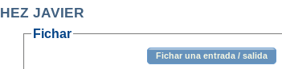

# dont-forget-kelio

Programa para no olvidar fichar al llegar y desfichar al irme. Lanza una alerta cada vez que se conecta o se desconecta un dispositivo USB a elegir (por ejemplo, el teléfono móvil). 

Audio generado por 
